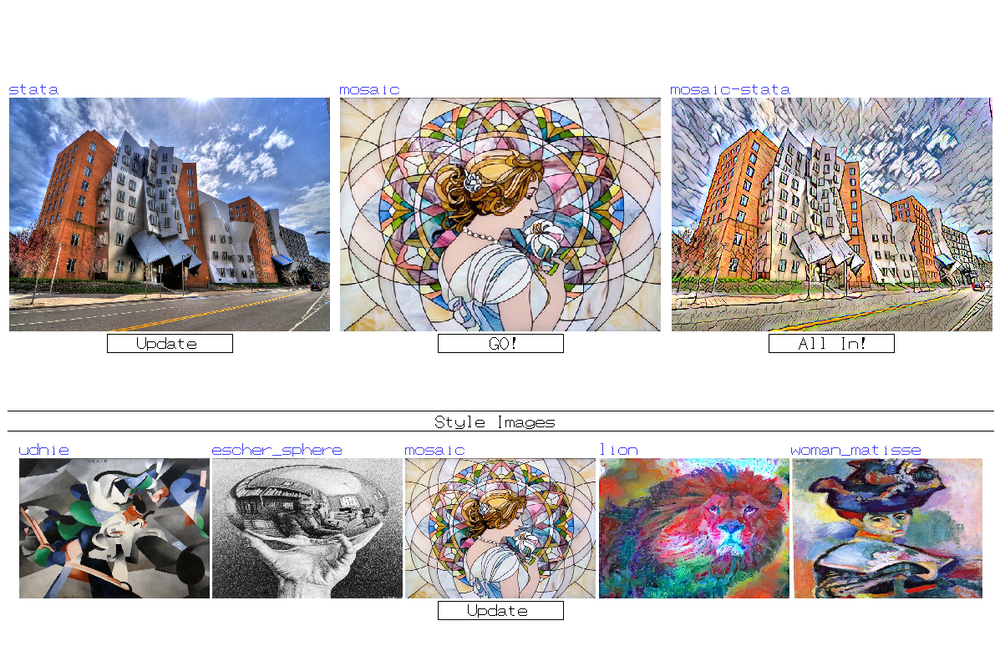

# App for Style Transfer

This app was built using the C++ UI framework which was designed for 
the course project of Advanced Engineering Computation (24-783). The UI framework was built on top of an OpenGL window framework called FsLazyWindow designed by 
Prof. Soji Yamakawa at Carnegie Mellon University. The framework follows the following hierarchy. 

[Tensorflow implementation](https://github.com/elleryqueenhomels/arbitrary_style_transfer) of style transfer using adaptive instance normalisation was 
used as the backend for transferring style. The app outputs an image inside the ui after transferring a style of an image onto 
a content image.
 
###Recommended Requirement
* Linux environment

The program has been tested on linux (Ubuntu-16.04) and was designed to be cross platform
(Windows and MacOS), it can easily be ported by replacing file reading capabilities of dirent.h 
included in [libraries](./src/framework/utils/libraries.h) and the functions called in  [bmplocations](./src/framework/utils/bmplocations.cpp)

### Other Requirements
* Python 3.5 environment, required libraries are present in requirements.txt (tensorflow model would be used to transfer style onto image)
* *cmake* and *make* capabilities (if you wish to build the app from source)

### Running the App
* Run [setup_script.sh](setup_script.sh) to download the data files (training checkpoint and vgg weights).
* In the terminal activate the python environment after installing all the libraries listed in requirements.txt
* Run the [Style transfer executable](Style_transfer).

### Using the app:
* Use left and right arrow keys to change the style image and up and down arrow keys
to change the content image.
* Press **GO** to transfer the style onto the content image. (Initialises the tensorflow model).
* More images can be added in the [images](./images) folder. You can update the app to read the new images by pressing the Update button.
* If you wish to transfer style of all style images onto all content images, press **ALL IN**.

### Building the app from source:
* Make a build directory inside the current project. Inside the build directory, run *cmake* for the [src](./src)
directory.
* Run *make*, the exectuable would appear immediately outside the build directory.

### User Interface

